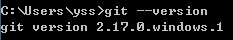
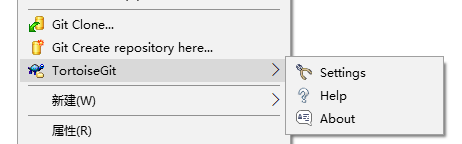
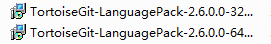
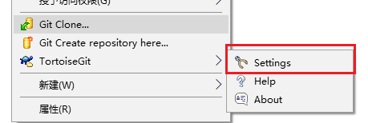
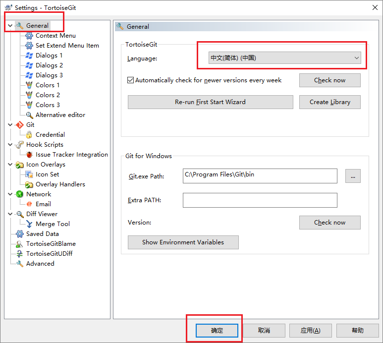
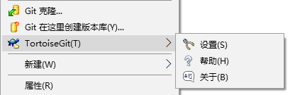
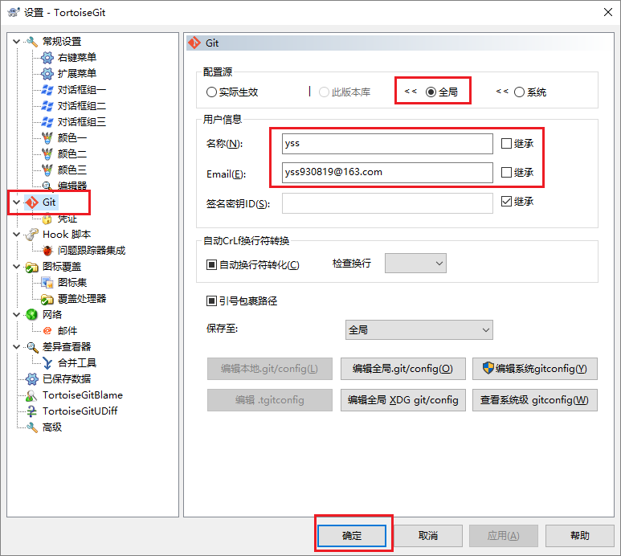

# Git使用说明

Git是一个开源的分布式版本控制系统，可以有效、高速的处理从很小到非常大的项目版本管理。本说明适用的软件为：Git，TortoiseGit和Gitea。

[TOC]

## 一台新电脑的开始

一台新电脑要想使用GIT需要有如下的环境:
1.  GIT客户端。  
1.  GIT_GUI客户端。（软件有SmartGit，SourceTree，TortoiseGit等）
1.  配置GIT的一些默认参数。

### 安装GIT客户端

1. 选择一个GIT安装包，建议为X64。  

1. 启动安装程序， 出现下面界面时做如下选择。  

1. 之后安装，直接选择默认选项即可。

1. 完成安装后，通过**cmd**输入`git --version`检查GIT版本验证安装成功。(教程中软件版本为2.17.0)  

### 安装GIT_GUI客户端

本教程使用的GIT_GUI客户端为**TortoiseGit**

#### 基本软件安装

1. 选择一个TortoiseGit安装包，建议为X64。  

1. 运行安装程序，全部都使用默认配置安装。

1. 安装结束后，在**资源管理器**空白处右键菜单就可以看到**TortoiseGit**菜单，安装成功。

#### 中文语言包安装(*可选*)

1. 安装中文语言包，选择对应办版本的语言包。  

1. 安装使用默认配置即可。

1. 安装结束后，在**资源管理器**空白处右键，选择**TortoiseGit**->**设置**。  

1. 按照下面图所示设置语言为**中文**并保存设置。  

1. 在**资源管理器**空白处右键检查语言包安装情况。  

### 配置GIT的默认参数

在使用GIT之前需要对GIT进行简单的配置，设置提交人的名称和邮箱步骤如下：
1. 在**资源管理器**空白处右键，选择**TortoiseGit**->**设置**。  

1. 按照下面图所示设置**名称**和**email**并保存设置。  

> 至此对于一台新电脑已经具备了使用GIT的全部环境。

## GIT服务器搭建

*本部分仅建议服务器管理人员使用查看*  

GIT服务器版本有很多包括：
* Gitblit 使用java开发，多平台可以使用
* Gitlab 使用Ruby开发类似Github，只能在Linux中运行
* GoGs,Gitea 使用新的go语言编写，支持全平台。

本教程以**Gitea**为例说明服务端的搭建过程。

1. 将Gitea程序放置到

## 本地简单使用

## 连接Gitea使用

