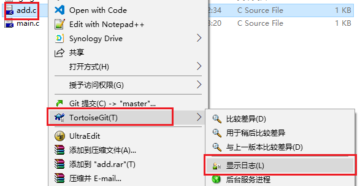
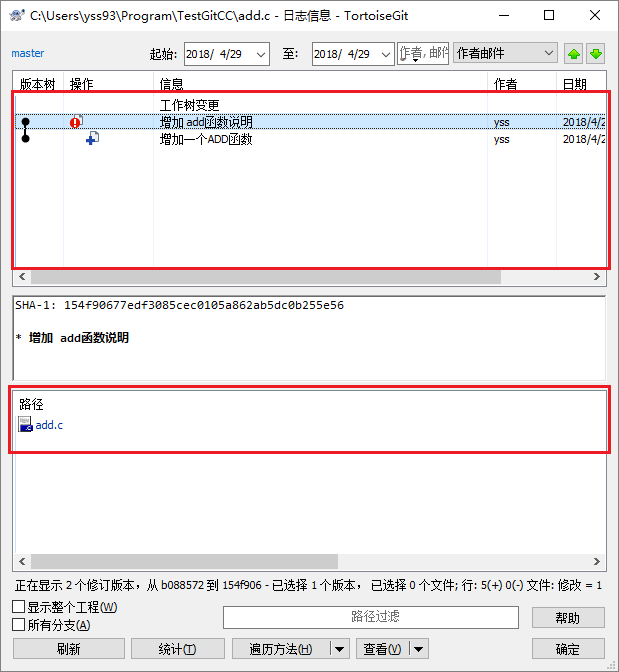
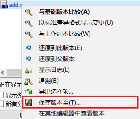
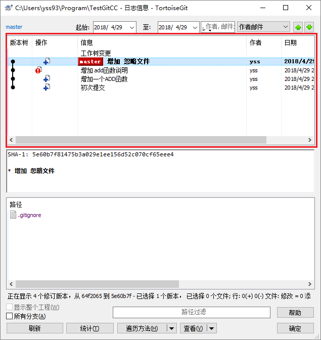

# Git使用教程

Git是一个开源的分布式版本控制系统，可以有效、高速的处理从很小到非常大的项目版本管理。本说明适用的软件为：Git，TortoiseGit和Gitea。
本教程是一个简单的快速上手说明只使用了git的简单功能。对GIT的深入使用可以看官方的[Pro Git](https://git-scm.com/book/zh/v2)

## 快速入门

### [一台新电脑的开始](./快速上手/git安装/readme.md)
本部分教程将教你如何在一台全新的电脑上安装git和使用相关的GUI工具（我们以TortoiseGit为教程对象）。

### [本地简单使用](./快速上手/git本地使用/readme.md)

## 本地简单使用

由于Git的版本管理功能是分布式的，因此在没有服务器的情况下Git也能够进行版本管理。下面说明Git的本地使用方法。

### 已有文件使用版本控制

在一个已有文件的文件夹下使用Git版本控制的方法如下：
本例以`TestGitCC`项目为说明，项目为一个**Hello World**程序。  

1. 在**资源管理器**中切换到`TestGitCC`项目的目录下。  

1. 在空白的地方右键，并点击**Git在这里创建版本库**。  

1. 使用默认设置完成版本库创建。  

1. 再次在空白的地方右键，并点击**Git提交**。  

1. 在弹出的对话框中填写 **提交说明** 并勾选 **main.c** ，完成版本库的第一次提交。  

### 在空文件夹使用版本控制

在本地新建一个版本库的过程如下:

1. 通过**资源管理器**在任意位置建立一个空的文件夹。  

1. 然后在文件夹中空白的地方右键，并点击**Git在这里创建版本库**。  

1. 使用默认设置完成版本库创建。  

1. 这时若开启隐藏文件显示，就可以看到一个**.Git**文件夹，证明仓库创建完成。  

### 增加一个新的文件

对于Git的使用无非就是三点:**增、删和改**。首先介绍Git增加一个文件方法。
本例还以`TestGitCC`项目为例说明，在项目中增加一个**add.c**文件，并增加add函数。

1. 在**资源管理器**中切换到`TestGitCC`项目的目录下。  

1. 在空白的地方右键，并点击**Git提交**。  

1. 在弹出的对话框中填写 **提交说明** 并勾选 **add.c** ，最后点击**提交**。  

### 修改文件之后的操作

下面介绍对文件修改后的提交方法。
本例以`TestGitCC`项目为例说明，在项目中为**add.c**文件增加注释。

1. 在**资源管理器**中切换到`TestGitCC`项目的目录下。  

1. 在空白的地方右键，并点击**Git提交**。  

1. 在弹出的对话框中填写 **提交说明**，最后点击**提交**。(已在仓库中的文件不用再次勾选)  

### 如何排除一个不想管理的文件？

下面介绍对文件忽略提交方法。
本例以`TestGitCC`项目为例说明，在项目中忽略**Debug**文件夹，其中为编译后的EXE文件。

1. 在**资源管理器**中切换到`TestGitCC`项目的目录下。  

1. 选中**Debug**文件夹并在其上右键选择**TortoiseGit**->**添加到忽略列表**->**Debnug**  

1. 在弹出的对话框中都使用默认选项并**确认**。  

1. 在`TestGitCC`项目下会多出一个**.gitignore**文件。  

1. 参照[2.3. 增加一个新的文件](#23-增加一个新的文件)提交 **.gitignore** 文件  

### 如何查看以前版本的文件？

在使用Git之后查看历史版本的文件将变得跟加简单和轻松。 
这里还是以`TestGitCC`项目为例说明。

#### 查看一个文件或文件夹的历史版本
这里选用`TestGitCC`中的**add.c**文件夹为例说明

1. 找到想查看的文件或文件夹，选中并在其上右键，点击**TortoiseGit**->**显示日志**。   

1. 弹出的对话框中上半部分显示了**add.c**的所有**提交信息**，下方显示了该次提交**修改过的文件**，**add.c**文件会高亮为**蓝色**。   

1. 在文件上右键点击**保存版本至**可以将该历史版本的文件切换出来。  

1. 在文件上双击可以查看文件的这个文件与父文件的修改情况。  

#### 查看整个项目的历史版本

1. 在`TestGitCC`项目的根目录的空白区域右键，点击**TortoiseGit**->**显示日志**。  

1. 在弹出对话框中可以看到项目所有的提交记录。  

1. 之后可以切换出**老版本文件**和**查看修改记录**。  

### 如何删除一个已经管理的文件？

删除文件有两种情况，下面分别说明。

#### 简单删除
这里选用`TestGitCC`中的**add.c**文件夹为例说明。add.c文件在项目中并没有调用，但是还是希望保留文件的以前版本情况，使用简单删除功能即可。

1. 在**资源管理器**中切换到`TestGitCC`项目的目录下,直接删除**add.c**文件。  

1. 在空白的地方右键，并点击**Git提交**。  

1. 在弹出的对话框中填写 **提交说明** ，最后点击**提交**。  

#### 使用git功能删除
这里选用`TestGitCC`中的**main.exe**为例说明，我们错误的将一个exe文件提交入了版本库。  
GIT对于二进制文件做的版本管理会每次都保存文件的全部内容并不能进行增量备份，因此在多次编译后仓库会非常巨大，对于二进制文件不建议使用git进行管理。  
下面说明另一个用git删除文件的方法。  

1. 在**资源管理器**中切换到`TestGitCC`项目的目录下,找到**main.exe**文件。

1. 选中**main.exe**文件，并右键点击**TortoiseGit**->**删除并保留本地副本**

1. 然后，在空白的地方右键，并点击**Git提交**。  

1. 在弹出的对话框中填写 **提交说明** ，最后点击**提交**。  

1. 最后为了防止二进制文件被提交，可以将其加入**gitignore**文件中。

## Git服务器搭建

*本部分仅建议服务器管理人员使用查看*  

Git服务器的程序有很多人开，目前比较有名的程序有：
* **Gitblit：** 使用java开发，多平台可以使用
* **Gitlab：** 使用Ruby开发类似Github，只能在Linux中运行
* **GoGs,Gitea：** 使用新的go语言编写，支持全平台。

本教程以**Gitea**为例说明服务端的搭建过程，搭建实例的机器为`192.168.1.16`服务器。  

1. 将Gitea程序放置到`D:\Gitea\`目录下。  

1. 选则适当的版本运行Gitea。  

1. 通过[http://127.0.0.1:3000/]访问Gitea。  

1. 首次访问需要对Gitea进行配置，配置说明如下图所示,最后点击**安装**。(点击安装会出现gitea.db文件无法打开问题**可以在`D:\Gitea\data`下新建一个`txt`文件然后更名为`gitea.db`**)   
    **数据库:** SQLite3  
    **数据库文件路径：**  D:\Gitea\data\gitea.db  
    **应用名称:** git服务网站     
    **仓库根目录：**  D:\Gitea\data\gitea-repositories  
    **域名:** 192.168.1.16  
    **应用URL：**  [http://192.168.1.16:3000/]  
    **管理员用户名:** gitea  
    **管理员密码：** 根据情况设置  
    **管理员邮箱：** 根据情况设置  
      

1. 完成设置之后，关闭Gitea。  

1. 通过管理员身份启动**cmd**  

1. 通过如下命令进行Gitea服务注册，设置其开机自启动。      

    **x64版本**    
        `sc create gitea binPath= "D:\Gitea\gitea-1.4.0-windows-4.0-amd64.exe" start= auto`    
    **x86版本**  
        `sc create gitea binPath= "D:\Gitea\gitea-1.4.0-windows-4.0-386.exe" start= auto`    
    
        
1. 通过任务管理器查看服务已启动。  

1. 通过[http://192.168.1.16:3000/]访问，验证服务安装成功。  

## Git的协作之旅

在有了Git服务器之后便可以通过服务器进行Git项目的管理，同时能够通过服务器实现项目的多人协作开发。下面将介绍如何使用gitea进行操作。
### Gitea注册账号

1. 访问Gitea主页面([http://192.168.1.16:3000/])，点击**注册**。  

1. 填写相关信息完成注册。  

1. 登录账号验证注册。  
  

### 本地已有版本库
可能你已经拥有了一个本地的Git版本库，并有了相当多的历史提记录。下面将指导你如何将一个已有的版本库同步到服务器中。
这里同样以`TestGitCC`项目为例进行说明。

1. 访问Gitea主页面([http://192.168.1.16:3000/])，点击**登录**。  

  

1. 点击**＋**->**创建新的仓库**。

1. 如下，填写仓库相关信息。  
    **仓库名称:** TestGitCC  
    **仓库描述:** Git服务的使用说明(根据情况填写)  
    **可见性:** 根据情况选择      

1. 完成创建后结果如下，复制**HTTP**的链接。  

1. 在**资源管理器**中切换到`TestGitCC`项目的目录下。 

1. 在空白处右键，点击**TortoiseGit**->**推送**。  

1. 在弹出的对话框中点击**管理**。  

1. 在管理对话框中将拷贝的**HTTP**的链接填入**URL**中。  

1. 推送到服务端    

1. 在网页中检查推送结果   
  

### 服务端新建版本库

这里创建一个带有**gitignore**文件和**README.md**文件初始化的仓库

1. 访问Gitea主页面([http://192.168.1.16:3000/])，点击**登录**。  
  
  

1. 点击**＋**->**创建新的仓库**。  

1. 如下，填写仓库相关信息。  
    **仓库名称:** TestGit2  
    **仓库描述:** 服务端新建的仓库(根据情况填写)  
    **可见性:** 根据情况选择  
    **.gitignore:** `c`,`c++`,`Visual Studio`,`Visual Studio Code`    
    **使用选定文件和模板初始化仓库:** 勾选    

1. 复制仓库的**HTTP**链接。  

1. 打开**资源管理器**，找到一个没有git的文件夹下。   

1. 在空白的地方右键，点击**克隆**。   

1. 弹出的对话框直接使用默认设置（拷贝链接会直接贴入**URL**）。  

1. 打开项目文件夹，然后就可以在文件夹中肆意妄为了。  

### 推送提交的内容

相比于Git的本地使用，在协作开发时需要注意的就是将提交推送到服务端。  
这里以`TestGit2`项目为例说明，推送方法。我们为`TestGit2`增加一个**main.c**文件，并已经将文件提交到本地。

1. 在**资源管理器**中切换到`TestGit2`项目的目录下。 

1. 在空白处右键，点击**TortoiseGit**->**推送**。  

1. 在弹出对话框中直接点击**确认**，推送数据即可。  

<!--内部链接-->
[http://127.0.0.1:3000/]:(http://127.0.0.1:3000/)
[http://192.168.1.16:3000/]:(http://192.168.1.16:3000/)