## Git的协作之旅

在有了Git服务器之后便可以通过服务器进行Git项目的管理，同时能够通过服务器实现项目的多人协作开发。下面将介绍如何使用gitea进行操作。
### Gitea注册账号

1. 访问Gitea主页面([http://192.168.1.16:3000/])，点击**注册**。  

1. 填写相关信息完成注册。  
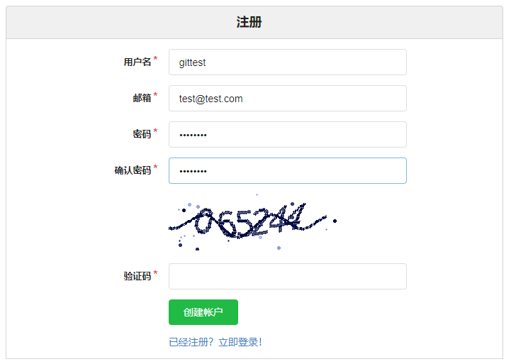

1. 登录账号验证注册。  
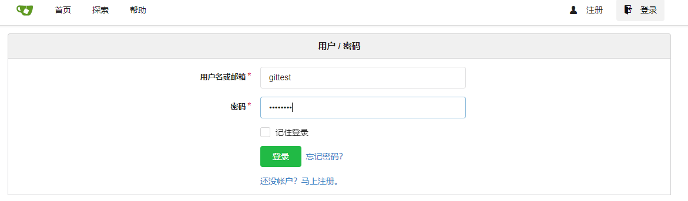  
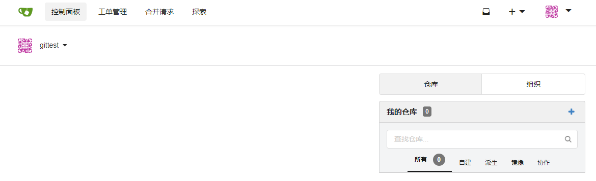

### 本地已有版本库
可能你已经拥有了一个本地的Git版本库，并有了相当多的历史提记录。下面将指导你如何将一个已有的版本库同步到服务器中。
这里同样以`TestGitCC`项目为例进行说明。

1. 访问Gitea主页面([http://192.168.1.16:3000/])，点击**登录**。  

  

1. 点击**＋**->**创建新的仓库**。
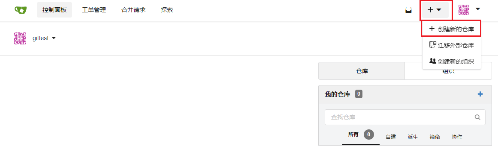

1. 如下，填写仓库相关信息。  
    **仓库名称:** TestGitCC  
    **仓库描述:** Git服务的使用说明(根据情况填写)  
    **可见性:** 根据情况选择      
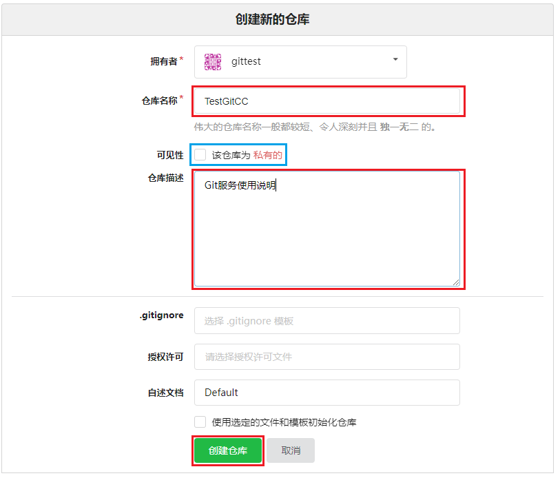

1. 完成创建后结果如下，复制**HTTP**的链接。  
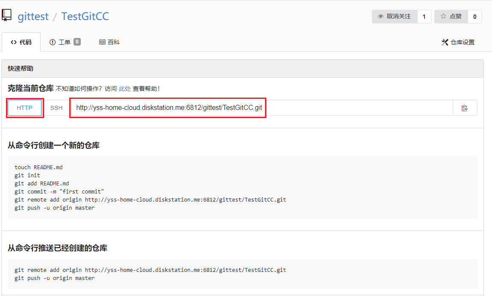

1. 在**资源管理器**中切换到`TestGitCC`项目的目录下。 

1. 在空白处右键，点击**TortoiseGit**->**推送**。  
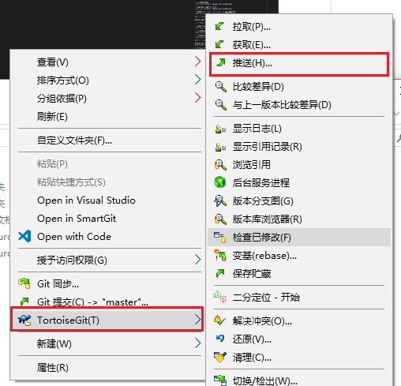

1. 在弹出的对话框中点击**管理**。  
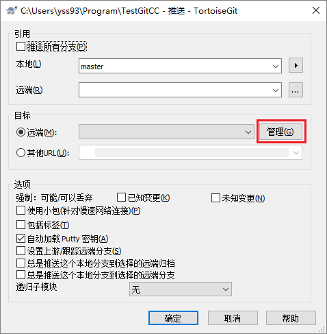

1. 在管理对话框中将拷贝的**HTTP**的链接填入**URL**中。  
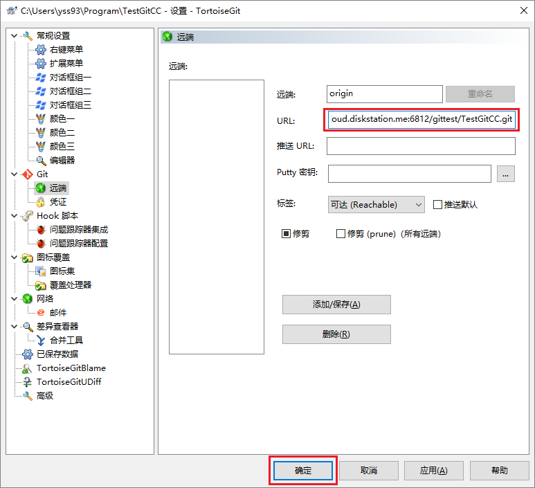

1. 推送到服务端    
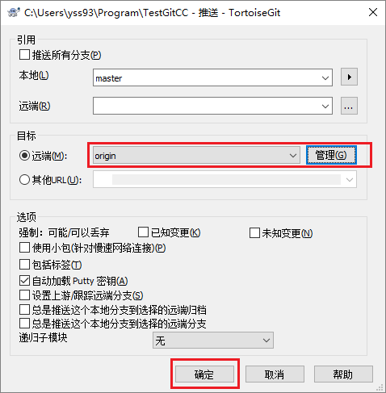

1. 在网页中检查推送结果   
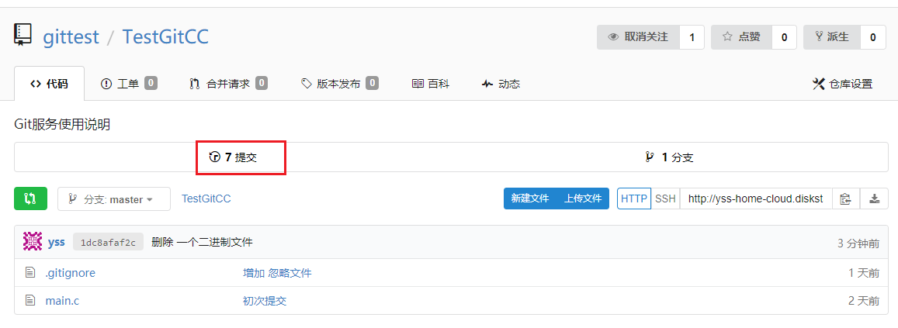  
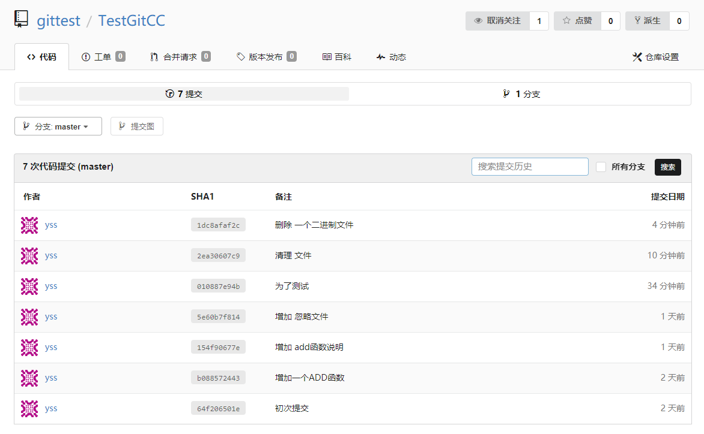

### 服务端新建版本库

这里创建一个带有**gitignore**文件和**README.md**文件初始化的仓库

1. 访问Gitea主页面([http://192.168.1.16:3000/])，点击**登录**。  
  
  

1. 点击**＋**->**创建新的仓库**。  

1. 如下，填写仓库相关信息。  
    **仓库名称:** TestGit2  
    **仓库描述:** 服务端新建的仓库(根据情况填写)  
    **可见性:** 根据情况选择  
    **.gitignore:** `c`,`c++`,`Visual Studio`,`Visual Studio Code`    
    **使用选定文件和模板初始化仓库:** 勾选    
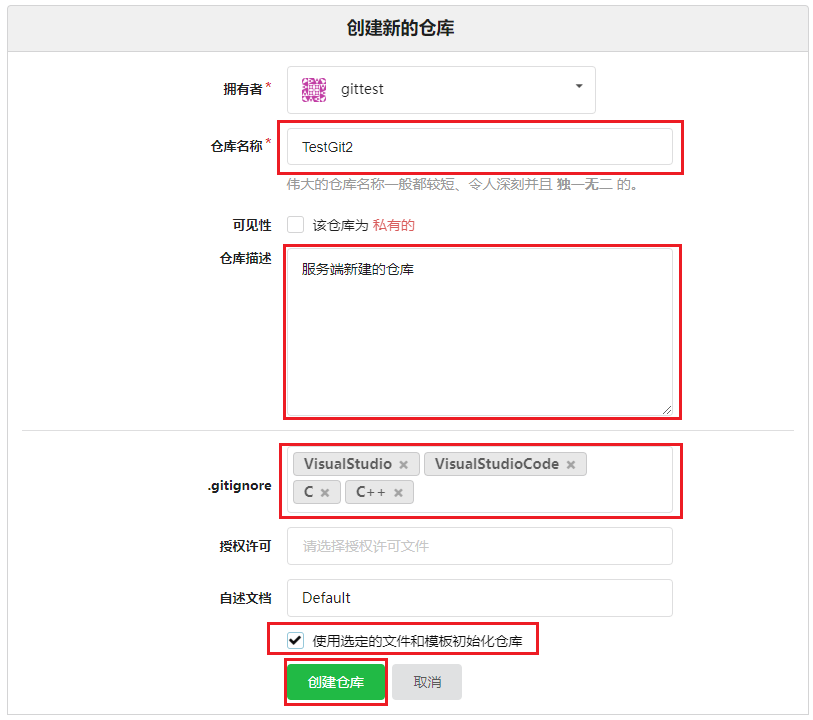

1. 复制仓库的**HTTP**链接。  
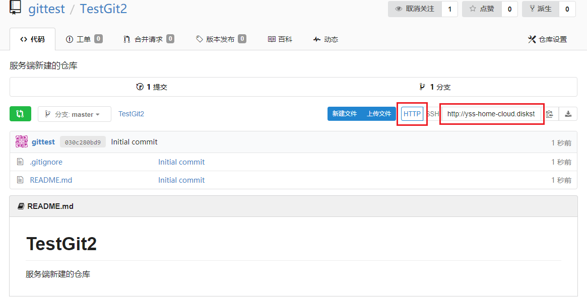

1. 打开**资源管理器**，找到一个没有git的文件夹下。   

1. 在空白的地方右键，点击**克隆**。   
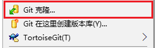

1. 弹出的对话框直接使用默认设置（拷贝链接会直接贴入**URL**）。  
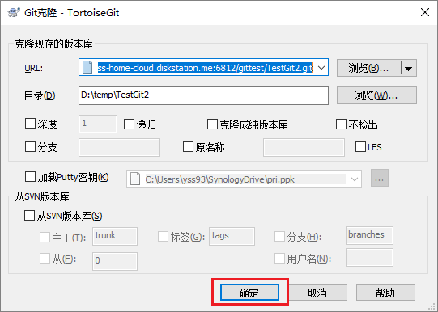

1. 打开项目文件夹，然后就可以在文件夹中肆意妄为了。  
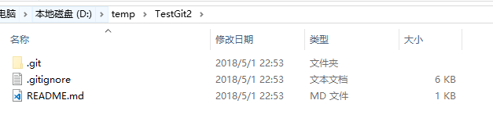

### 推送提交的内容

相比于Git的本地使用，在协作开发时需要注意的就是将提交推送到服务端。  
这里以`TestGit2`项目为例说明，推送方法。我们为`TestGit2`增加一个**main.c**文件，并已经将文件提交到本地。

1. 在**资源管理器**中切换到`TestGit2`项目的目录下。 

1. 在空白处右键，点击**TortoiseGit**->**推送**。  

1. 在弹出对话框中直接点击**确认**，推送数据即可。  
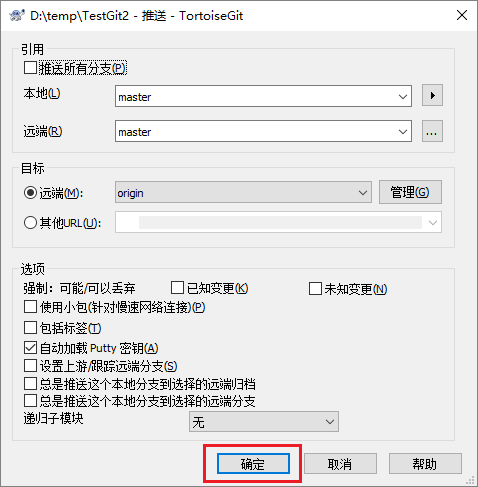

<!--内部链接-->
[http://127.0.0.1:3000/]:(http://127.0.0.1:3000/)
[http://192.168.1.16:3000/]:(http://192.168.1.16:3000/)