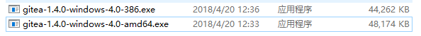
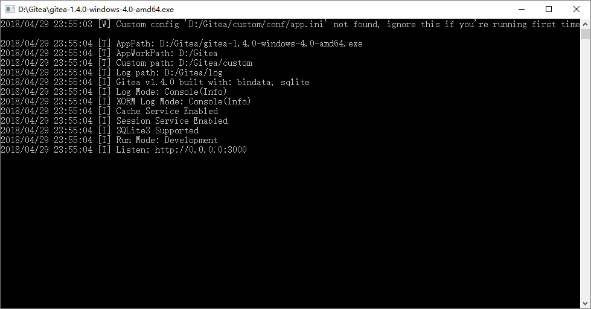
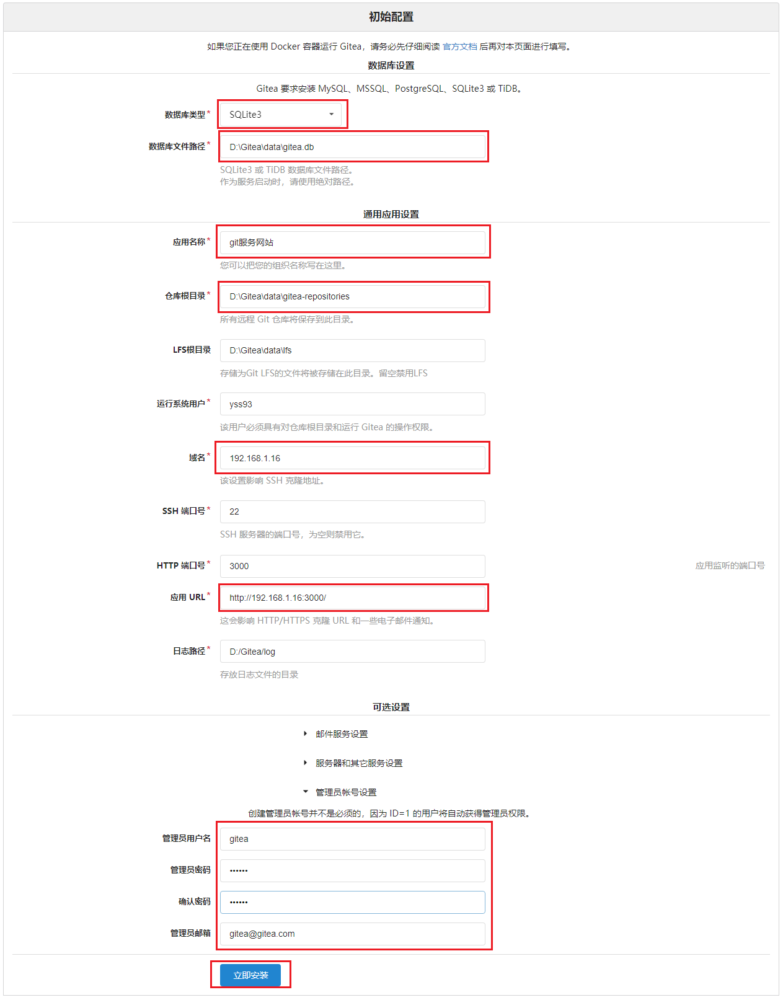
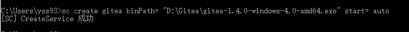
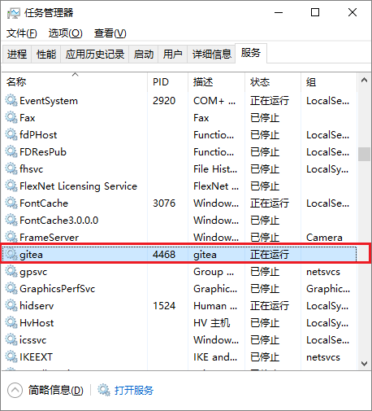

## Git服务器搭建

本部分仅建议服务器管理人员使用查看
  

Git服务器的程序有很多人开，目前比较有名的程序有：
* **Gitblit：** 使用java开发，多平台可以使用
* **Gitlab：** 使用Ruby开发类似Github，只能在Linux中运行
* **GoGs,Gitea：** 使用新的go语言编写，支持全平台。

本教程以**Gitea**为例说明服务端的搭建过程，搭建实例的机器为`192.168.1.16`服务器。  

1. 将Gitea程序放置到`D:\Gitea\`目录下。  

1. 选则适当的版本运行Gitea。  

1. 通过[http://127.0.0.1:3000/]访问Gitea。  

1. 首次访问需要对Gitea进行配置，配置说明如下图所示,最后点击**安装**。(点击安装会出现gitea.db文件无法打开问题**可以在`D:\Gitea\data`下新建一个`txt`文件然后更名为`gitea.db`**)   
    **数据库:** SQLite3  
    **数据库文件路径：**  D:\Gitea\data\gitea.db  
    **应用名称:** git服务网站     
    **仓库根目录：**  D:\Gitea\data\gitea-repositories  
    **域名:** 192.168.1.16  
    **应用URL：**  [http://192.168.1.16:3000/]  
    **管理员用户名:** gitea  
    **管理员密码：** 根据情况设置  
    **管理员邮箱：** 根据情况设置  
      

1. 完成设置之后，关闭Gitea。  

1. 通过管理员身份启动**cmd**  

1. 通过如下命令进行Gitea服务注册，设置其开机自启动。      

    **x64版本**    
        `sc create gitea binPath= "D:\Gitea\gitea-1.4.0-windows-4.0-amd64.exe" start= auto`    
    **x86版本**  
        `sc create gitea binPath= "D:\Gitea\gitea-1.4.0-windows-4.0-386.exe" start= auto`    
    
        
1. 通过任务管理器查看服务已启动。  

1. 通过[http://192.168.1.16:3000/]访问，验证服务安装成功。  

<!--内部链接-->
[http://127.0.0.1:3000/]:(http://127.0.0.1:3000/)
[http://192.168.1.16:3000/]:(http://192.168.1.16:3000/)