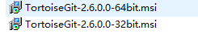
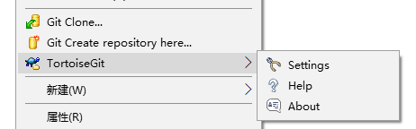
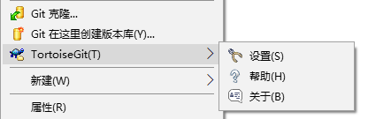

## 一台新电脑的开始

一台新电脑要想使用Git需要有如下的环境:
1.  Git客户端。  
1.  Git_GUI客户端。（软件有SmartGit，SourceTree，TortoiseGit等）
1.  配置Git的一些默认参数。

### 安装Git客户端

1. 选择一个Git安装包，建议为X64。  

1. 启动安装程序， 出现下面界面时做如下选择。  

1. 之后安装，直接选择默认选项即可。

1. 完成安装后，通过**cmd**输入`git --version`检查Git版本验证安装成功。(教程中软件版本为2.17.0)  

### 安装Git_GUI客户端

本教程使用的Git_GUI客户端为**TortoiseGit**

#### 基本软件安装

1. 选择一个TortoiseGit安装包，建议为X64。  

1. 运行安装程序，全部都使用默认配置安装。

1. 安装结束后，在**资源管理器**空白处右键菜单就可以看到**TortoiseGit**菜单，安装成功。

#### 中文语言包安装(*可选*)

1. 安装中文语言包，选择对应办版本的语言包。  

1. 安装使用默认配置即可。  

1. 安装结束后，在**资源管理器**空白处右键，选择**TortoiseGit**->**设置**。  

1. 按照下面图所示设置语言为**中文**并保存设置。  

1. 在**资源管理器**空白处右键检查语言包安装情况。  

### 配置Git的默认参数

在使用Git之前需要对Git进行简单的配置，设置提交人的名称和邮箱步骤如下：
1. 在**资源管理器**空白处右键，选择**TortoiseGit**->**设置**。  

1. 按照下面图所示设置**名称**和**email**并保存设置。  

> 至此对于一台新电脑已经具备了使用Git的全部环境。
