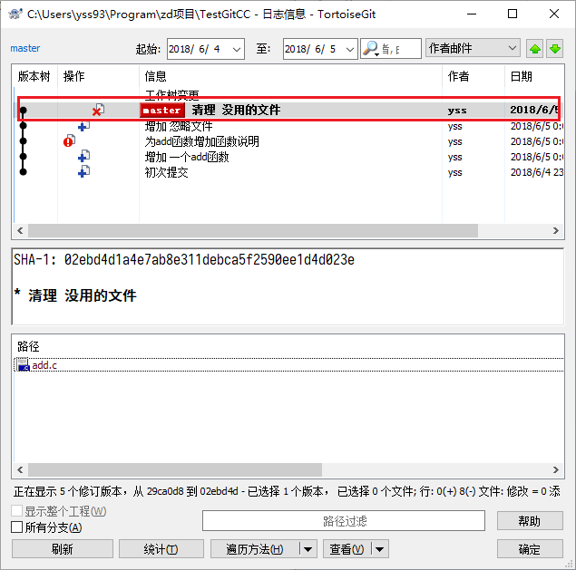

<!-- TOC -->

- [本地简单使用](#本地简单使用)
    - [集中管理与分布式管理（摘自[廖雪峰的网站](https://www.liaoxuefeng.com/wiki/0013739516305929606dd18361248578c67b8067c8c017b000/001374027586935cf69c53637d8458c9aec27dd546a6cd6000)）](#集中管理与分布式管理摘自廖雪峰的网站httpswwwliaoxuefengcomwiki0013739516305929606dd18361248578c67b8067c8c017b000001374027586935cf69c53637d8458c9aec27dd546a6cd6000)
    - [已有文件使用版本控制](#已有文件使用版本控制)
    - [在空文件夹使用版本控制](#在空文件夹使用版本控制)
    - [扩充我们的仓库--增加文件](#扩充我们的仓库--增加文件)
    - [优化我们的仓库--修改文件](#优化我们的仓库--修改文件)
    - [排除“垃圾”文件--忽略文件](#排除垃圾文件--忽略文件)
    - [剔除“垃圾”文件--删除文件](#剔除垃圾文件--删除文件)
    - [时光机的回溯--浏览历史与版本还原](#时光机的回溯--浏览历史与版本还原)

<!-- /TOC -->

## 本地简单使用

由于Git的版本管理功能是分布式的，因此在没有服务器的情况下Git也能够进行版本管理。下面说明Git的本地使用方法。下面简单说一下集中与分布的特点

### 集中管理与分布式管理（摘自[廖雪峰的网站](https://www.liaoxuefeng.com/wiki/0013739516305929606dd18361248578c67b8067c8c017b000/001374027586935cf69c53637d8458c9aec27dd546a6cd6000)）
Linus一直痛恨的CVS及SVN都是集中式的版本控制系统，而Git是分布式版本控制系统，集中式和分布式版本控制系统有什么区别呢？

先说集中式版本控制系统，版本库是集中存放在中央服务器的，而干活的时候，用的都是自己的电脑，所以要先从中央服务器取得最新的版本，然后开始干活，干完活了，再把自己的活推送给中央服务器。中央服务器就好比是一个图书馆，你要改一本书，必须先从图书馆借出来，然后回到家自己改，改完了，再放回图书馆。


集中式版本控制系统最大的毛病就是必须联网才能工作，如果在局域网内还好，带宽够大，速度够快，可如果在互联网上，遇到网速慢的话，可能提交一个10M的文件就需要5分钟，这还不得把人给憋死啊。

那分布式版本控制系统与集中式版本控制系统有何不同呢？首先，分布式版本控制系统根本没有“中央服务器”，每个人的电脑上都是一个完整的版本库，这样，你工作的时候，就不需要联网了，因为版本库就在你自己的电脑上。既然每个人电脑上都有一个完整的版本库，那多个人如何协作呢？比方说你在自己电脑上改了文件A，你的同事也在他的电脑上改了文件A，这时，你们俩之间只需把各自的修改推送给对方，就可以互相看到对方的修改了。

和集中式版本控制系统相比，分布式版本控制系统的安全性要高很多，因为每个人电脑里都有完整的版本库，某一个人的电脑坏掉了不要紧，随便从其他人那里复制一个就可以了。而集中式版本控制系统的中央服务器要是出了问题，所有人都没法干活了。

在实际使用分布式版本控制系统的时候，其实很少在两人之间的电脑上推送版本库的修改，因为可能你们俩不在一个局域网内，两台电脑互相访问不了，也可能今天你的同事病了，他的电脑压根没有开机。因此，分布式版本控制系统通常也有一台充当“中央服务器”的电脑，但这个服务器的作用仅仅是用来方便“交换”大家的修改，没有它大家也一样干活，只是交换修改不方便而已。


### 已有文件使用版本控制

在一个已有文件的文件夹下使用Git版本控制的方法如下：
我们已经有了一个名为`TestGitCC`项目，该项目为一个**Hello World**程序。  

1. 在**资源管理器**中切换到`TestGitCC`项目的目录下。  


1. 在空白的地方右键，并点击**Git在这里创建版本库**。  


1. 使用默认设置完成版本库创建。  


1. 再次在空白的地方右键，并点击**Git提交**。  


1. 在弹出的对话框中填写 **提交说明** 并勾选 **main.c** ，完成版本库的第一次提交。  


### 在空文件夹使用版本控制

在一个空文件夹下建立版本库的过程如下:

1. 通过**资源管理器**在任意位置建立一个空的文件夹。  

1. 然后在文件夹中空白的地方右键，并点击**Git在这里创建版本库**。  


1. 使用默认设置完成版本库创建。  


1. 这时若开启隐藏文件显示，就可以看到一个**.Git**文件夹，证明仓库创建完成。  


### 扩充我们的仓库--增加文件

继续以`TestGitCC`项目为例，我们在项目中增加了一个**add.c**文件，并增加add函数如下。
``` c
int add(int a,int b){
    return a+b;
}
```
之后需要提交这个文件到我们的仓库

1. 在**资源管理器**中切换到`TestGitCC`项目的目录下。  

1. 在空白的地方右键，并点击**Git提交**。  


1. 在弹出的对话框中填写 **提交说明** 并勾选 **add.c** ，最后点击**提交**。  


### 优化我们的仓库--修改文件

继续操作`TestGitCC`项目。增加完函数我们跃跃欲试，我们还想修改这个文件，我们需要为add函数增加注释。
``` c
/****
*  加法函数
*  输入： a , b
*  输出： a + b
*/
int add(int a,int b){
    return a+b;
}
```

1. 在**资源管理器**中切换到`TestGitCC`项目的目录下。  

1. 在空白的地方右键，并点击**Git提交**。  


1. 在弹出的对话框中填写 **提交说明**，最后点击**提交**。(已在仓库中的文件不用再次勾选)  


### 排除“垃圾”文件--忽略文件

我们怀着激动的心情，编译了第一个使用Git管理的项目`TestGitCC`，我们发现项目中多出了一个 **Debug** 文件夹并且，它会显示在提交界面里，这样每次提交都看到对于有强迫症的人而言实在不爽！


因此我们需要将项目中忽略的 **Debug** 文件夹忽略掉，让它以后再也不显示。

1. 在**资源管理器**中切换到`TestGitCC`项目的目录下。  

1. 选中**Debug**文件夹并在其上右键选择**TortoiseGit**->**添加到忽略列表**->**Debug**  
  

1. 在弹出的对话框中都使用默认选项并**确认**。  


1. 在`TestGitCC`项目下会多出一个**.gitignore**文件。  


1. 参照[2.3. 增加一个新的文件](#23-增加一个新的文件)提交 **.gitignore** 文件  


### 剔除“垃圾”文件--删除文件
在做完上述工作我们发现add函数我们根本没有用到啊!对于一个强迫症而言，没用的东西都是垃圾需要清理，这里我们就把**add.c**删除吧。（请放心大胆的删除，我们有了git就有了历史版本，**add.c**还可以还原）

1. 在**资源管理器**中切换到`TestGitCC`项目的目录下,直接删除**add.c**文件。  

1. 在空白的地方右键，并点击 **Git提交**。  


1. 在弹出的对话框中填写 **提交说明** ，最后点击 **提交**。(注意这里**add.c**显示为缺失也就是删除的意思)  


### 时光机的回溯--浏览历史与版本还原

现在，我们将进入时光机一起浏览我们对项目作出的修改！我们不需要记住我们每次都改了啥，Git已经都处理好了，我们只需准确填写

1. 在`TestGitCC`项目的根目录的空白区域右键，点击**TortoiseGit**->**显示日志**。  


1. 在弹出对话框中可以看到项目所有的提交记录。  


不好，现在我们还是想要要回我们的**add.c**文件，我们需要将其还原到带注释的版本。
 
1. 找到 **清理 没用的文件** 的这条提交。  


1. 在下面**add.c**上右键，选择**还原到父版本**。  


1. 然后见证奇迹**add.c**文件回来了！  


时光机还能帮我们进行版本比较，不过这个功能就留到高手进阶再介绍了~