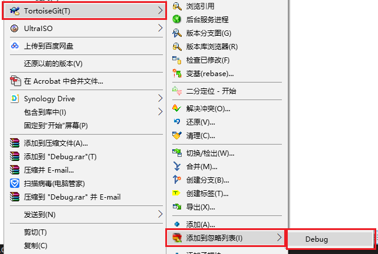
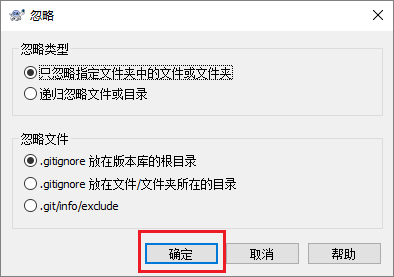
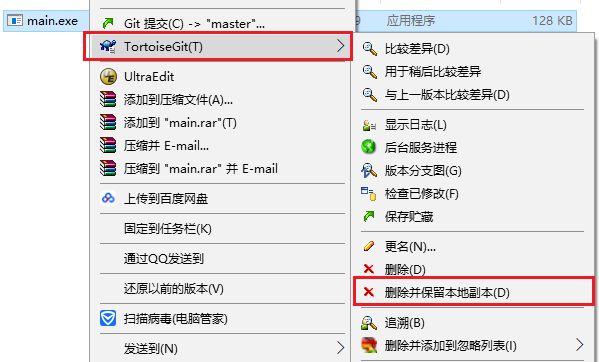

## 本地简单使用

由于Git的版本管理功能是分布式的，因此在没有服务器的情况下Git也能够进行版本管理。下面说明Git的本地使用方法。

### 已有文件使用版本控制

在一个已有文件的文件夹下使用Git版本控制的方法如下：
本例以`TestGitCC`项目为说明，项目为一个**Hello World**程序。  

1. 在**资源管理器**中切换到`TestGitCC`项目的目录下。  

1. 在空白的地方右键，并点击**Git在这里创建版本库**。  

1. 使用默认设置完成版本库创建。  

1. 再次在空白的地方右键，并点击**Git提交**。  

1. 在弹出的对话框中填写 **提交说明** 并勾选 **main.c** ，完成版本库的第一次提交。  

### 在空文件夹使用版本控制

在本地新建一个版本库的过程如下:

1. 通过**资源管理器**在任意位置建立一个空的文件夹。  

1. 然后在文件夹中空白的地方右键，并点击**Git在这里创建版本库**。  

1. 使用默认设置完成版本库创建。  

1. 这时若开启隐藏文件显示，就可以看到一个**.Git**文件夹，证明仓库创建完成。  

### 增加一个新的文件

对于Git的使用无非就是三点:**增、删和改**。首先介绍Git增加一个文件方法。
本例还以`TestGitCC`项目为例说明，在项目中增加一个**add.c**文件，并增加add函数。

1. 在**资源管理器**中切换到`TestGitCC`项目的目录下。  

1. 在空白的地方右键，并点击**Git提交**。  

1. 在弹出的对话框中填写 **提交说明** 并勾选 **add.c** ，最后点击**提交**。  

### 修改文件之后的操作

下面介绍对文件修改后的提交方法。
本例以`TestGitCC`项目为例说明，在项目中为**add.c**文件增加注释。

1. 在**资源管理器**中切换到`TestGitCC`项目的目录下。  

1. 在空白的地方右键，并点击**Git提交**。  

1. 在弹出的对话框中填写 **提交说明**，最后点击**提交**。(已在仓库中的文件不用再次勾选)  

### 如何排除一个不想管理的文件？

下面介绍对文件忽略提交方法。
本例以`TestGitCC`项目为例说明，在项目中忽略**Debug**文件夹，其中为编译后的EXE文件。

1. 在**资源管理器**中切换到`TestGitCC`项目的目录下。  

1. 选中**Debug**文件夹并在其上右键选择**TortoiseGit**->**添加到忽略列表**->**Debnug**  

1. 在弹出的对话框中都使用默认选项并**确认**。  

1. 在`TestGitCC`项目下会多出一个**.gitignore**文件。  

1. 参照[2.3. 增加一个新的文件](#23-增加一个新的文件)提交 **.gitignore** 文件  

### 如何查看以前版本的文件？

在使用Git之后查看历史版本的文件将变得跟加简单和轻松。 
这里还是以`TestGitCC`项目为例说明。

#### 查看一个文件或文件夹的历史版本
这里选用`TestGitCC`中的**add.c**文件夹为例说明

1. 找到想查看的文件或文件夹，选中并在其上右键，点击**TortoiseGit**->**显示日志**。   

1. 弹出的对话框中上半部分显示了**add.c**的所有**提交信息**，下方显示了该次提交**修改过的文件**，**add.c**文件会高亮为**蓝色**。   

1. 在文件上右键点击**保存版本至**可以将该历史版本的文件切换出来。  

1. 在文件上双击可以查看文件的这个文件与父文件的修改情况。  

#### 查看整个项目的历史版本

1. 在`TestGitCC`项目的根目录的空白区域右键，点击**TortoiseGit**->**显示日志**。  

1. 在弹出对话框中可以看到项目所有的提交记录。  

1. 之后可以切换出**老版本文件**和**查看修改记录**。  

### 如何删除一个已经管理的文件？

删除文件有两种情况，下面分别说明。

#### 简单删除
这里选用`TestGitCC`中的**add.c**文件夹为例说明。add.c文件在项目中并没有调用，但是还是希望保留文件的以前版本情况，使用简单删除功能即可。

1. 在**资源管理器**中切换到`TestGitCC`项目的目录下,直接删除**add.c**文件。  

1. 在空白的地方右键，并点击**Git提交**。  

1. 在弹出的对话框中填写 **提交说明** ，最后点击**提交**。  

#### 使用git功能删除
这里选用`TestGitCC`中的**main.exe**为例说明，我们错误的将一个exe文件提交入了版本库。  
GIT对于二进制文件做的版本管理会每次都保存文件的全部内容并不能进行增量备份，因此在多次编译后仓库会非常巨大，对于二进制文件不建议使用git进行管理。  
下面说明另一个用git删除文件的方法。  

1. 在**资源管理器**中切换到`TestGitCC`项目的目录下,找到**main.exe**文件。

1. 选中**main.exe**文件，并右键点击**TortoiseGit**->**删除并保留本地副本**

1. 然后，在空白的地方右键，并点击**Git提交**。  

1. 在弹出的对话框中填写 **提交说明** ，最后点击**提交**。  

1. 最后为了防止二进制文件被提交，可以将其加入**gitignore**文件中。