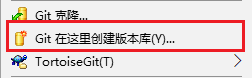
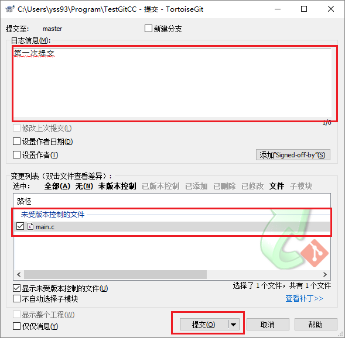
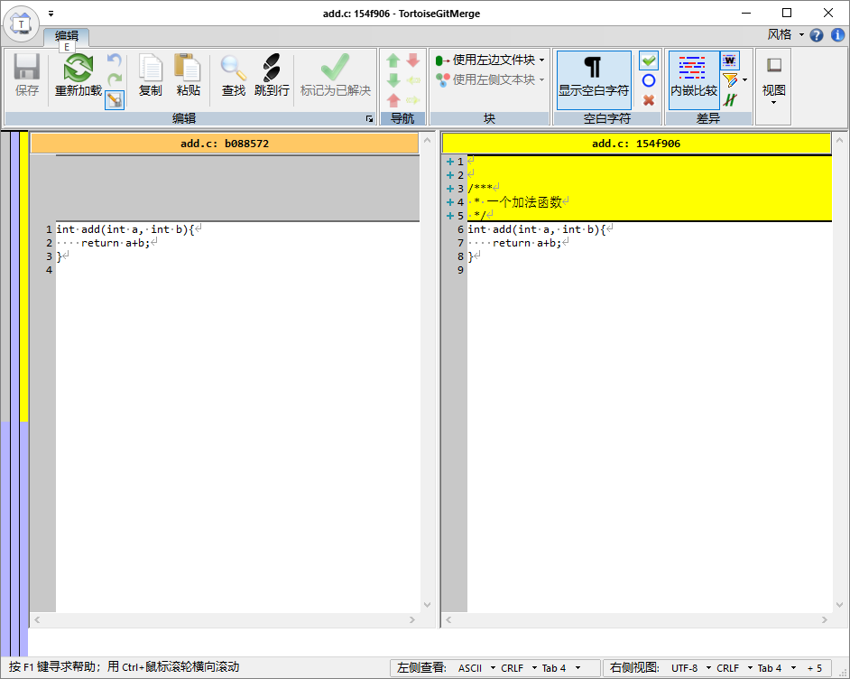

## 本地简单使用

由于Git的版本管理功能是分布式的，因此在没有服务器的情况下Git也能够进行版本管理。下面说明Git的本地使用方法。下面简单说一下集中与分布的特点

### 集中管理与分布式管理（摘自[廖雪峰的网站](https://www.liaoxuefeng.com/wiki/0013739516305929606dd18361248578c67b8067c8c017b000/001374027586935cf69c53637d8458c9aec27dd546a6cd6000)）
Linus一直痛恨的CVS及SVN都是集中式的版本控制系统，而Git是分布式版本控制系统，集中式和分布式版本控制系统有什么区别呢？

先说集中式版本控制系统，版本库是集中存放在中央服务器的，而干活的时候，用的都是自己的电脑，所以要先从中央服务器取得最新的版本，然后开始干活，干完活了，再把自己的活推送给中央服务器。中央服务器就好比是一个图书馆，你要改一本书，必须先从图书馆借出来，然后回到家自己改，改完了，再放回图书馆。


集中式版本控制系统最大的毛病就是必须联网才能工作，如果在局域网内还好，带宽够大，速度够快，可如果在互联网上，遇到网速慢的话，可能提交一个10M的文件就需要5分钟，这还不得把人给憋死啊。

那分布式版本控制系统与集中式版本控制系统有何不同呢？首先，分布式版本控制系统根本没有“中央服务器”，每个人的电脑上都是一个完整的版本库，这样，你工作的时候，就不需要联网了，因为版本库就在你自己的电脑上。既然每个人电脑上都有一个完整的版本库，那多个人如何协作呢？比方说你在自己电脑上改了文件A，你的同事也在他的电脑上改了文件A，这时，你们俩之间只需把各自的修改推送给对方，就可以互相看到对方的修改了。

和集中式版本控制系统相比，分布式版本控制系统的安全性要高很多，因为每个人电脑里都有完整的版本库，某一个人的电脑坏掉了不要紧，随便从其他人那里复制一个就可以了。而集中式版本控制系统的中央服务器要是出了问题，所有人都没法干活了。

在实际使用分布式版本控制系统的时候，其实很少在两人之间的电脑上推送版本库的修改，因为可能你们俩不在一个局域网内，两台电脑互相访问不了，也可能今天你的同事病了，他的电脑压根没有开机。因此，分布式版本控制系统通常也有一台充当“中央服务器”的电脑，但这个服务器的作用仅仅是用来方便“交换”大家的修改，没有它大家也一样干活，只是交换修改不方便而已。


### 已有文件使用版本控制

在一个已有文件的文件夹下使用Git版本控制的方法如下：
我们已经有了一个名为`TestGitCC`项目，该项目为一个**Hello World**程序。  

1. 在**资源管理器**中切换到`TestGitCC`项目的目录下。  


1. 在空白的地方右键，并点击**Git在这里创建版本库**。  


1. 使用默认设置完成版本库创建。  


1. 再次在空白的地方右键，并点击**Git提交**。  


1. 在弹出的对话框中填写 **提交说明** 并勾选 **main.c** ，完成版本库的第一次提交。  


### 在空文件夹使用版本控制

在一个空文件夹下建立版本库的过程如下:

1. 通过**资源管理器**在任意位置建立一个空的文件夹。  

1. 然后在文件夹中空白的地方右键，并点击**Git在这里创建版本库**。  


1. 使用默认设置完成版本库创建。  


1. 这时若开启隐藏文件显示，就可以看到一个**.Git**文件夹，证明仓库创建完成。  


### 扩充我们的仓库--增加文件

继续以`TestGitCC`项目为例，我们在项目中增加了一个**add.c**文件，并增加add函数如下。
``` c
int add(int a,int b){
    return a+b;
}
```
之后需要提交这个文件到我们的仓库

1. 在**资源管理器**中切换到`TestGitCC`项目的目录下。  

1. 在空白的地方右键，并点击**Git提交**。  


1. 在弹出的对话框中填写 **提交说明** 并勾选 **add.c** ，最后点击**提交**。  


### 优化我们的仓库--修改文件

继续操作`TestGitCC`项目。增加完函数我们跃跃欲试，我们还想修改这个文件，我们需要为add函数增加注释。
``` c
/****
*  加法函数
*  输入： a , b
*  输出： a + b
*/
int add(int a,int b){
    return a+b;
}
```

1. 在**资源管理器**中切换到`TestGitCC`项目的目录下。  

1. 在空白的地方右键，并点击**Git提交**。  


1. 在弹出的对话框中填写 **提交说明**，最后点击**提交**。(已在仓库中的文件不用再次勾选)  


### 排除“垃圾”文件--忽略文件

下面介绍对文件忽略提交方法。
本例以`TestGitCC`项目为例说明，在项目中忽略**Debug**文件夹，其中为编译后的EXE文件。

1. 在**资源管理器**中切换到`TestGitCC`项目的目录下。  

1. 选中**Debug**文件夹并在其上右键选择**TortoiseGit**->**添加到忽略列表**->**Debug**  


1. 在弹出的对话框中都使用默认选项并**确认**。  


1. 在`TestGitCC`项目下会多出一个**.gitignore**文件。  


1. 参照[2.3. 增加一个新的文件](#23-增加一个新的文件)提交 **.gitignore** 文件  


### 时光机的回溯

在使用Git之后查看历史版本的文件将变得跟加简单和轻松。 
我们继续在`TestGitCC`项目中进行操作。

#### 查看一个文件或文件夹的历史版本
找到`TestGitCC`中的**add.c**文件

1. 找到想查看的文件或文件夹，选中并在其上右键，点击**TortoiseGit**->**显示日志**。   


1. 弹出的对话框中上半部分显示了**add.c**的所有**提交信息**，下方显示了该次提交**修改过的文件**，**add.c**文件会高亮为**蓝色**。   


1. 在文件上右键点击**保存版本至**可以将该历史版本的文件切换出来。  


1. 在文件上双击可以查看文件的这个文件与父文件的修改情况。  


#### 查看整个项目的历史版本

1. 在`TestGitCC`项目的根目录的空白区域右键，点击**TortoiseGit**->**显示日志**。  


1. 在弹出对话框中可以看到项目所有的提交记录。  


1. 之后可以切换出**老版本文件**和**查看修改记录**。  

### 如何删除一个已经管理的文件？

删除文件有两种情况，下面分别说明。

#### 简单删除
这里选用`TestGitCC`中的**add.c**文件夹为例说明。add.c文件在项目中并没有调用，但是还是希望保留文件的以前版本情况，使用简单删除功能即可。

1. 在**资源管理器**中切换到`TestGitCC`项目的目录下,直接删除**add.c**文件。  

1. 在空白的地方右键，并点击**Git提交**。  


1. 在弹出的对话框中填写 **提交说明** ，最后点击**提交**。  


#### 使用git功能删除
这里选用`TestGitCC`中的**main.exe**为例说明，我们错误的将一个exe文件提交入了版本库。  
GIT对于二进制文件做的版本管理会每次都保存文件的全部内容并不能进行增量备份，因此在多次编译后仓库会非常巨大，对于二进制文件不建议使用git进行管理。  
下面说明另一个用git删除文件的方法。  

1. 在**资源管理器**中切换到`TestGitCC`项目的目录下,找到**main.exe**文件。

1. 选中**main.exe**文件，并右键点击**TortoiseGit**->**删除并保留本地副本**


1. 然后，在空白的地方右键，并点击**Git提交**。  


1. 在弹出的对话框中填写 **提交说明** ，最后点击**提交**。  


1. 最后为了防止二进制文件被提交，可以将其加入**gitignore**文件中。