## Gitea 的进阶使用

Gitea除了简单的做仓库的管理，还能更为方便的进行团队协作开发，这里将主要介绍

### 组织

一个组织是协作开发的开始，通过组织可以建立分组控制权限，同时也能对项目进行更好的分组。

#### 创建组织

1. 打开Gitea，登录你的账号，然后按如下设置进行操作。
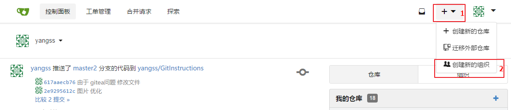

1. 填写组织名称
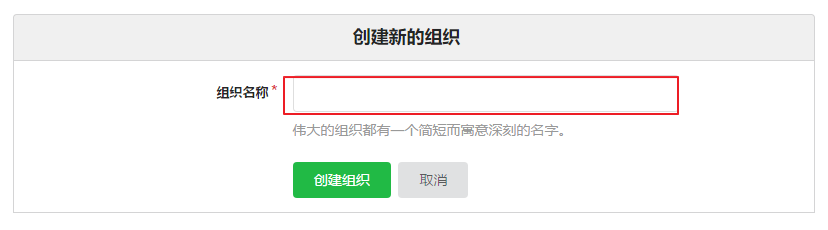

1. 建立完成
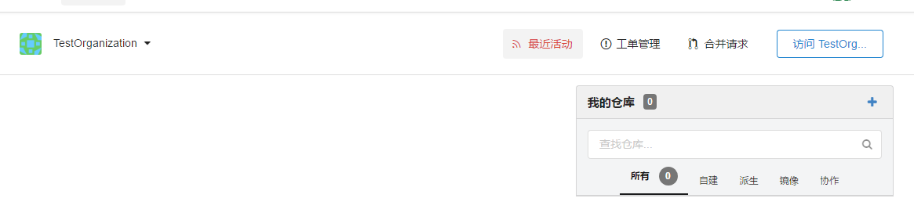

#### 为组织创建仓库

1. 点击**访问xx**  
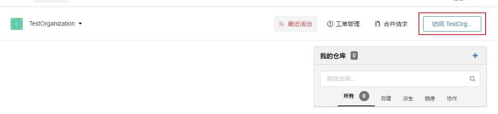

1. 然后点击 **创建新的仓库**  
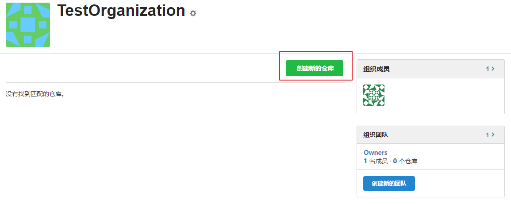

1. 填写信息创建仓库，确保为私有库才能控制权限  
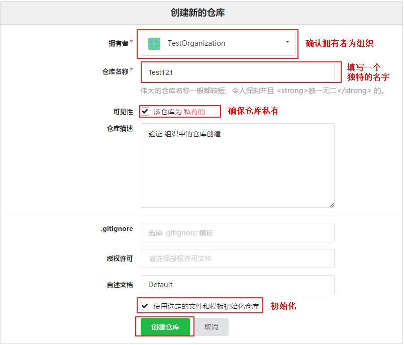

1. 仓库建立完成
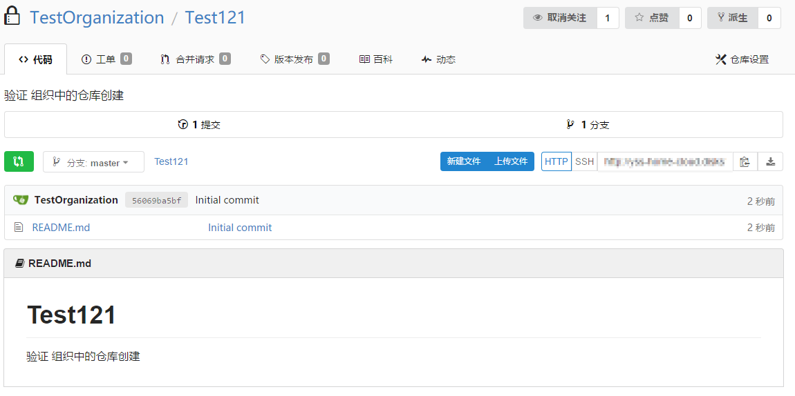

#### 创建团队

1. 点击 **创建新的团队**  
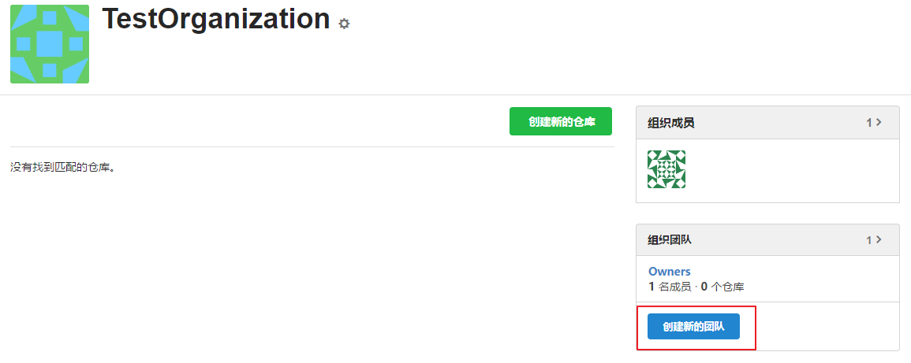

1. 填写团队信息，控制为只能写代码。
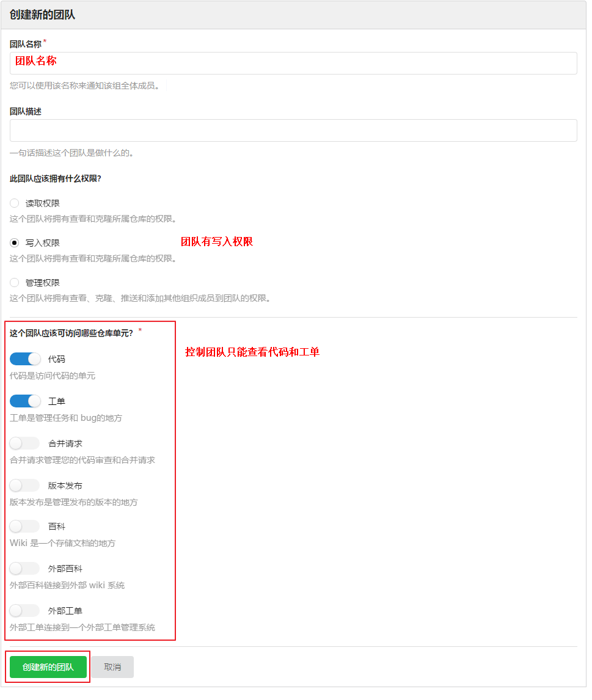

1. 创建完成
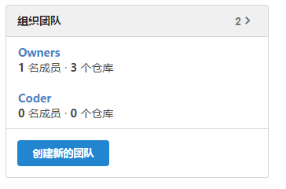

#### 设置团队人员和仓库  

1. 为团队`Coder`添加成员。  
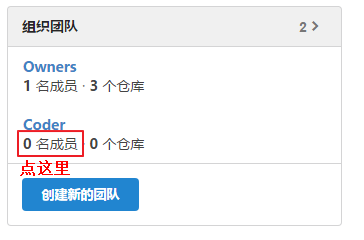  
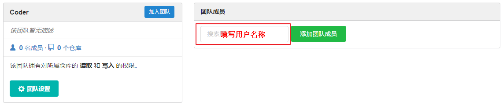  
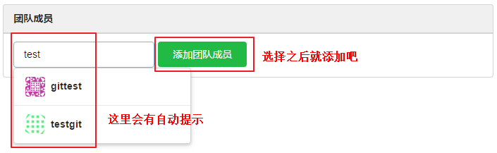  
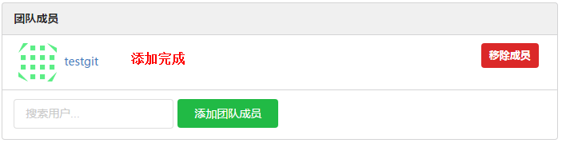   

1. 为团队`Coder`增加可查看仓库仓库  
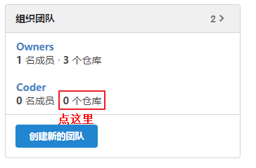  
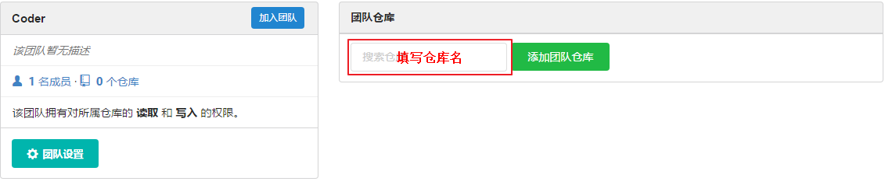  
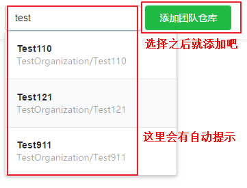  
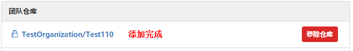  

1. 登陆`Owner`  
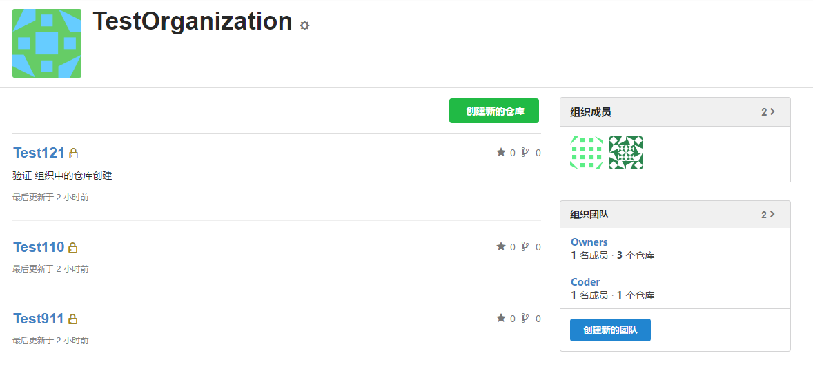   
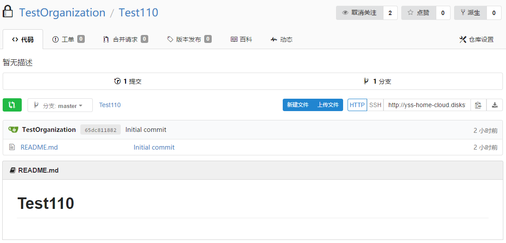    

1. 登陆`Coder`  
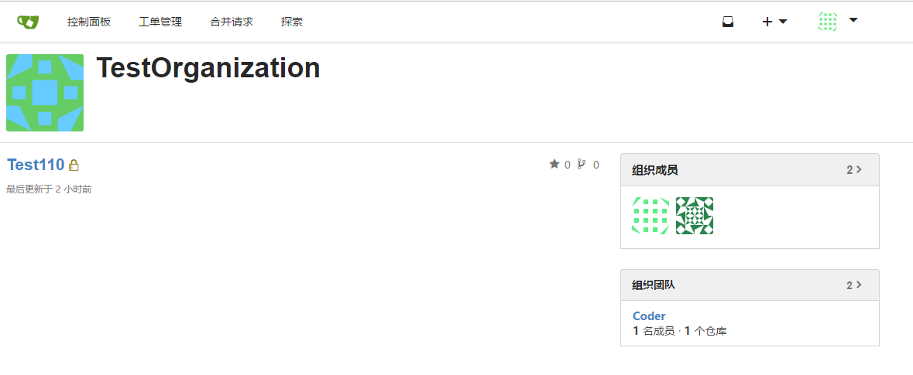   
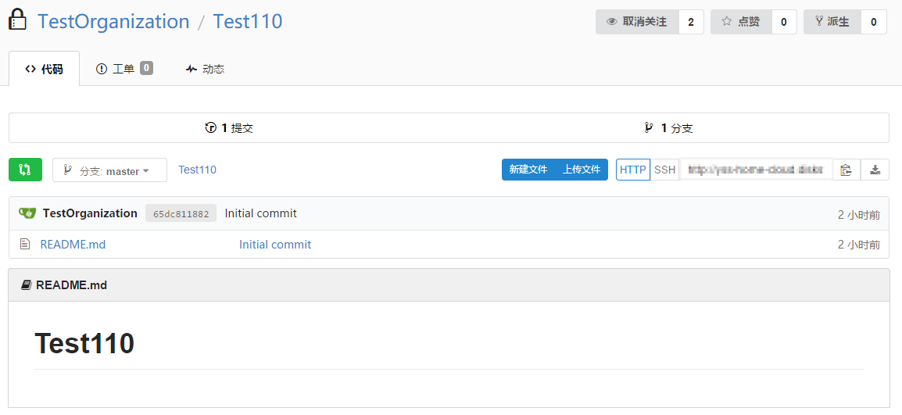    

#### 展示

一般可以将团队分为三个 `Owner`、`Coder`和`Reader`。（coder还可以细分为针对不同项目的）。  
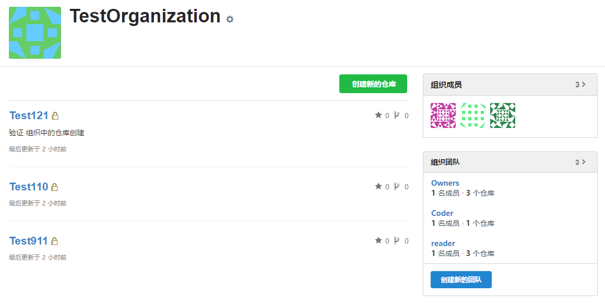 

### 工单

工单系统可以很好的进行开发任务管理。

#### 建立一个工单

1. 打开一个项目选择工单页面。  
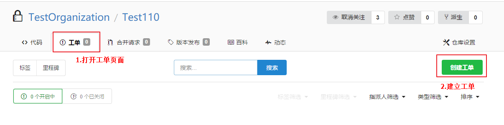 

2. 填写工单信息。   
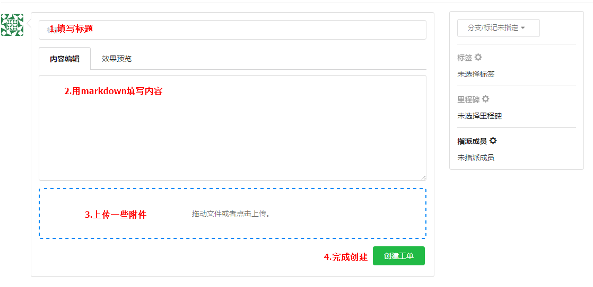 

#### 分配任务
工单右侧可以选择工单执行者
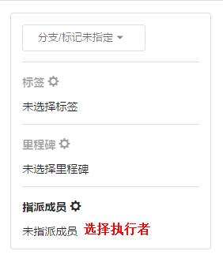 

#### 完成工单
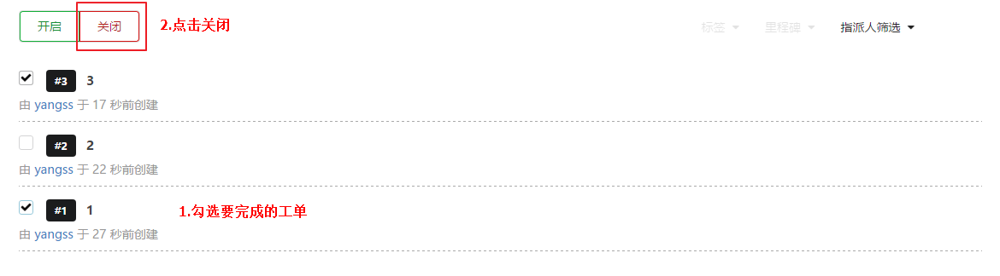 

