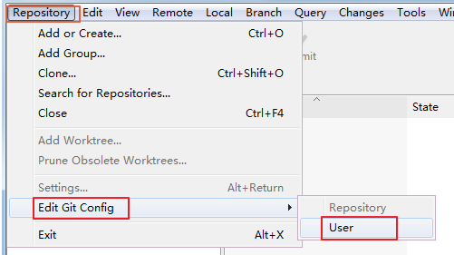
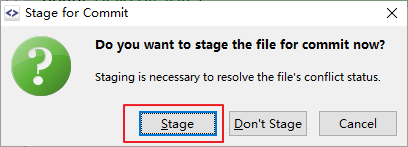
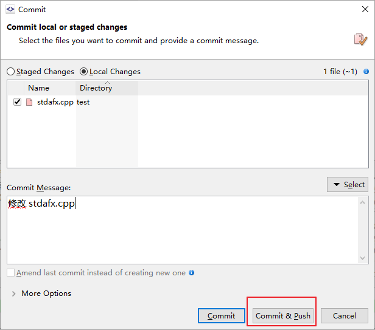

<!-- TOC -->

- [SmartGit的使用说明](#smartgit的使用说明)
    - [安装SmartGit](#安装smartgit)
    - [第一次启动SmartGit](#第一次启动smartgit)
    - [使用之前的准备工作](#使用之前的准备工作)
    - [上手使用SmartGit](#上手使用smartgit)
        - [建立一个git仓库](#建立一个git仓库)
        - [拉取服务器仓库](#拉取服务器仓库)
        - [两人协作时遇到的问题](#两人协作时遇到的问题)
    - [界面详细解析](#界面详细解析)

<!-- /TOC -->

## SmartGit的使用说明

使用了繁琐的小乌龟工具，相信你对Git的使用已经比较熟悉了。现在将介绍一个更为好用的Git GUI软件。它可以将Git管理在一个工作区内并通过更少的鼠标点击进行仓库的提交和推送。下面进入简单讲解

### 安装SmartGit

1. 找到SmartGit安装包  


1. 使用默认配置安装SmartGit

1. 检查右键SmartGit安装成功  


### 第一次启动SmartGit

1. 启动`SmartGit`，出现如下界面根据自身情况选择：
    - 30天试用（若是企业使用请选择这个或者购买激活码）
    - 输入激活码
    - 非商业使用（若是个人使用请选择这个）  


1. 在如下界面需要配置提交的作者和邮箱，**若电脑为多人使用请不要配置直接选择NEXT**。  
*（若要配置需要将邮箱和作者与Gitea中注册账号一致，这样可以让Gitea找到对应用户和头像）*  


1. 其他都使用默认即可。

1. 开启软件之后可能由于离线模式出现如下情况，选择`Cancel`和`skip`即可。  
  

1. 开启之后软件会自动检索系统中存在的仓库，并添加到软件中。
  

> 至此SmartGit的初步启动完成  

### 使用之前的准备工作

- 再次确认你的电脑是多人使用还是单人使用。
若为多人使用请点击`Repository` → `Edit Git Config` → `User`
在打开的界面中清除所有的内容！！！保留文件为空  
  

### 上手使用SmartGit

#### 建立一个git仓库
1. 在Gitea中建立一个版本库。（参看[Git协作之旅->服务端新建版本库](../../快速上手/Git协作之旅/readme.md)）

1. 在本地创建一个Git仓库。这里演示的本地仓库是通过VS建立的C++工程。  
    
    

1. 使用`pull`拉取仓库。这时会提醒你添加远端地址（remote），请拷贝Gitea中的地址吧！   
    
    

1. 这时会让你输入密码，你可以选择将密码保留在软件中  
    

1. 远端地址填写完成后再正式拉取（其实还是没有完成，只是将远端数据拉到的`.git`文件夹中）。   
    

1. 下面在[**分支区**](#界面详细解析)中可以看到`master`分支。并且有`1> <1`。请设置`master`分支追踪，
设置之后**Local**分支之后应该有`origin`。  
    
    

1. 最后执行`pull`，注意这里选择**rebase**。(之后的pull还是建议使用**merge**这样可以看到好看的分支图哦**1(\^-\^)1** )  
   

1. 这时我们的仓库完成初始化，我们可以提交我们的修改了！但是点击`Commit`它提醒我们需要设置邮箱！我们现在就去设置一下吧。  
   
   
   

1. 插曲过后继续对项目进行提交，`Ctrl+A`选中所有文件，然后点击`Commit`。填写日志信息后完成提交并推送。  
    
   

1. 在网站上检查一下成果吧~  
   

#### 拉取服务器仓库
这里我们拉取上一步中建立的仓库，使用默认配置拉去即可，最后注意仓库放置的位置（在拉取时遇到问题可以参看上面的步骤）  
   
   
   
         

#### 两人协作时遇到的问题
下面我将在上面提到的两个仓库中进行修改了提交，来模拟两个人操作时的情况。  
- 两个人修改同一个文件产生冲突（GIT有能够区分同一个文件的不同函数的修改，但是可能经常不好用，这里我们需要解决冲突）  
    1. **未修改前main函数**:  
        ``` cpp
        // test.cpp: 定义控制台应用程序的入口点。
        //
        #include "stdafx.h"
        int main()
        {
            return 0;
        }
        ```
    1. **人员1 修改并提交**：  
        人员1先修改并将修改进行提交和推送。    
        
        ``` c++
        // test.cpp: 定义控制台应用程序的入口点。
        //
        #include "stdafx.h"
        
        //
        // 程序主入口 
        // 
        int main()
        {
            return 0;
        }
        ```
                    

    1. **人员2 修改并提交**:  
        人员2与人员1同时修改文件，并提交但是没有做推送。现在人员1推送完了，人员2再进行推送时会提示无法推送
        需要先进行拉取，并解决冲突，然后再推送。  
        ``` cpp
        // test.cpp: 定义控制台应用程序的入口点。
        //
        #include "stdafx.h"
        int main()
        {
            printf("Hello,Git!\r\n");
            return 0;
        }
        ```
          
          
          
          
          
          
        这里或许需要先**commit**，再手动点击**push**,不能使用**Commit&Push**  
          
    1. **最后结果**:  
        可以看到文件被完美的合并了，同时两个的提交记录也交织在一起。  
           
           
           
  

- 两个人修改不同文件（这里GIT会自动合并）
    这里通过图片简略说明一下  
    **人员1**  
    继续上一个步骤，他还没有拉取人员2的推送。他这时修改了另一个文件，想要提交推送。这时会提示无法推送。
    需要先拉取一下文件，拉取后的结果如下，自动创建好了一个合并提交，之后只需进行push即可。  
       
       
       


### 界面详细解析

- 常用主界面解析  

   

- 常用子菜单解析  

   

   

- 文件状态说明  
  
  

